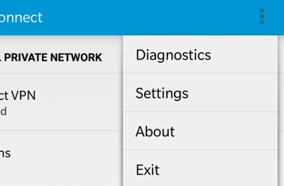
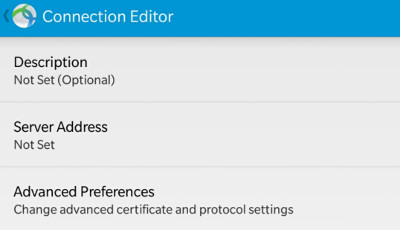
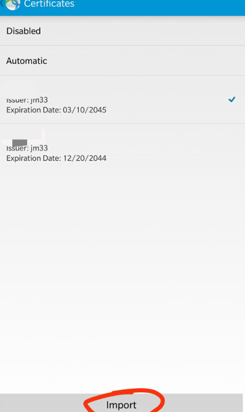
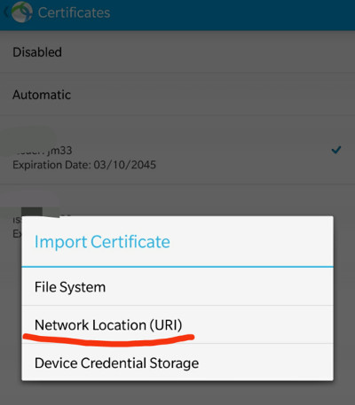
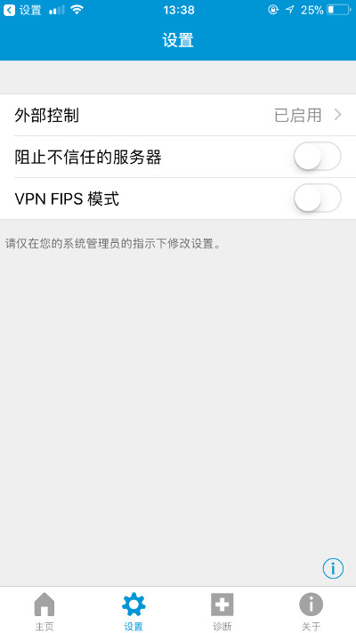
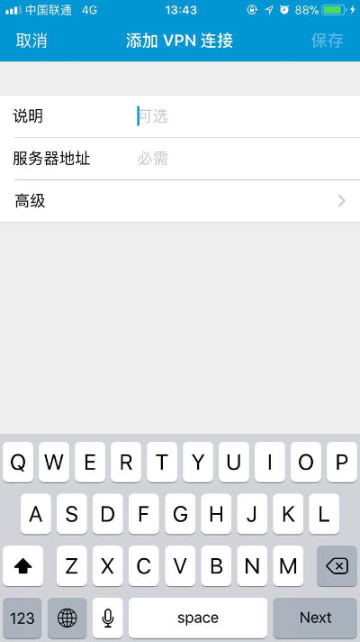
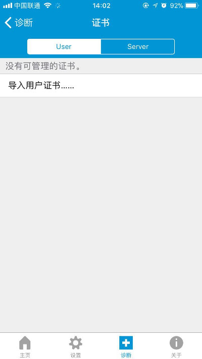

# How to Use Cisco Anyconnect VPN 
(Certificate based authentication)

- [Read me](#read-me)
  - [Disclaimer](#disclaimer)
  - [Error?](#error)
  - [Trusted downloads](#trusted-downloads)
- [Windows PC](#windows-pc)
- [Android](#android)
- [iOS](#ios)
- [BB10](#bb10)

## Read me

### Disclaimer

i've tested Android and Windows version myself, but i can't guarantee the accuracy of my tutorials for iOS and BB10 since i don't have those devices, and the screenshots are contributions from other users

### Error?
- if you get `untrusted server blocked` error, tap `change settings`, then uncheck `block untrusted servers`
- whenever prompted `do you wish to proceed`, yes you want to

### Trusted Downloads

[https://network.fiu.edu/vpn/](https://network.fiu.edu/vpn/)

## Windows PC

[download link](https://jm33.me/files/anyconnect-win-3.1.13015-pre-deploy-k9.msi)

## Android

[download link](https://jm33.me/files/com.cisco.anyconnect.vpn.android.avf_4.0.09029-345_minAPI14.apk) (if you were able to downoad it from other trusted sources, you can download it yourself)

set up your vpn connection

- install Cisco Anyconnect client

- open the app, go to settings

- allow untrusted servers

- add a VPN connection, set server address

- tap `Advanced Preferences`, then `Certificate`
- tap `Import`, then `URI`

- type the download link to your cert
- type the password to extract cert, and make sure the cert is selected for your connection
- save your vpn profile
- connect

## iOS

download Cisco Anyconnect app from App Store

- open Anyconnect app
- in `Settings` tab, allow untrusted servers, like this

- go back to `Home` tab, create new VPN

- type server address
- save your VPN profile
- in `Diagnostics` tab, import your user cert,

- import user cert from given URI, you will need a password to extract your cert
- edit your newly created VPN profile, make sure it uses your user cert for authentication
- try connecting

## BB10

download Cisco Anyconnect from BB World

set up vpn

1. install Anyconnect app, then go to vpn settings
2. download cert from given URL, then type the password to extract
3. choose Cisco Anyconnect as your VPN type
4. allow untrusted servers
5. type server address
6. save and connect
