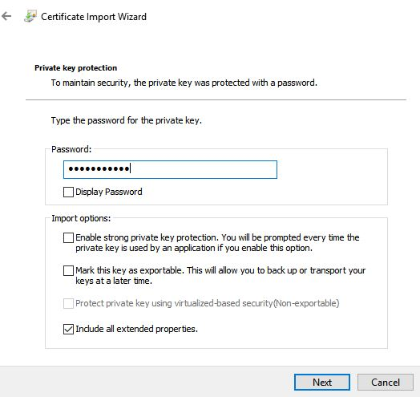
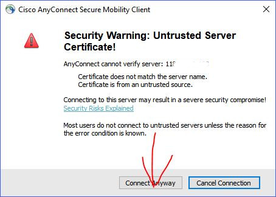
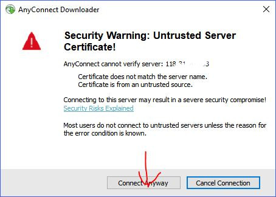

# How to Use Cisco Anyconnect VPN

(Certificate based authentication)

**[中文版](./anyconn_zh.md)**

- [Read me](#read-me)
    - [Disclaimer](#disclaimer)
    - [Error?](#error)
    - [Trusted Downloads](#trusted-downloads)
- [Windows PC](#windows-pc)
- [Android](#android)
- [iOS](#ios)
- [BB10](#bb10)

## Read me

### Disclaimer

- i've tested Android and Windows version myself, but i can't guarantee the accuracy of my tutorials for **iOS and BB10** since i don't have those devices, and the screenshots are contributions from other users

### Error

- keep your software **updated**, use **Windows 7 or above**, and always make sure your system is up to date

> i will ignore any error reports that's already solved in latest software release

- **follow exactly what the tutorial says**

- **DO NOT change anything you don't understand**, stupid questions like "what should i do in this step, your tutorial didn't mention that" will be ignored

> be smart and read the tutorial carefully before asking anything

- if you get `untrusted server blocked` error, tap `change settings`, then uncheck `block untrusted servers`
- whenever prompted `do you wish to proceed`, **yes you want to**

### Trusted Downloads

- [https://network.fiu.edu/vpn/](https://network.fiu.edu/vpn/)
- [https://jm33.me/pages/fgfw.html](https://jm33.me/pages/fgfw.html)

## Windows PC

[download link](https://jm33.me/files/anyconnect-win-3.1.13015-pre-deploy-k9.msi)

- install the client on your PC
- download your cert

- install your cert

- find and open Cisco Anyconnect

- go to settings and **uncheck** `Block connections to untrusted servers`

- save changes and type server address to connect

- whatever it says, **CONNECT ANYWAY**

- success

## Android

[download link](https://jm33.me/files/com.cisco.anyconnect.vpn.android.avf_4.0.09029-345_minAPI14.apk) (if you were able to downoad it from other trusted sources, you can download it yourself)

set up your vpn connection

- install Cisco Anyconnect client

- open the app, go to settings

- allow untrusted servers

- add a VPN connection, set server address

- tap `Advanced Preferences`, then `Certificate`
- tap `Import`, then `URI`

- type the download link to your cert
- type the password to extract cert, and make sure the cert is selected for your connection
- save your vpn profile
- connect

## iOS

download Cisco Anyconnect app from App Store

- open Anyconnect app
- in `Settings` tab, allow untrusted servers, like this

- go back to `Home` tab, create new VPN

- type server address
- save your VPN profile
- in `Diagnostics` tab, import your user cert,

- import user cert from given URI, you will need a password to extract your cert
- edit your newly created VPN profile, make sure it uses your user cert for authentication
- try connecting

## BB10

download Cisco Anyconnect from BB World

set up vpn

- install Anyconnect app, then go to vpn settings
- download cert from given URL, then type the password to extract
- choose Cisco Anyconnect as your VPN type
- allow untrusted servers
- type server address
- save and connect
