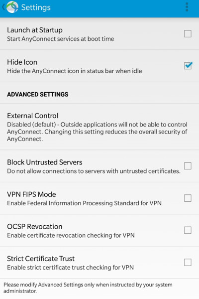
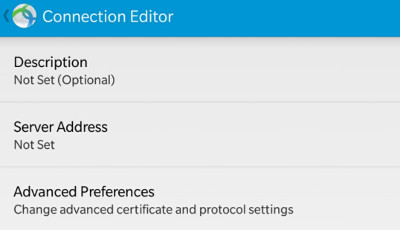

# 如何使用Cisco Anyconnect VPN

(基于证书的认证)

- [必读](#read-me)
     - [免责声明](#disclaimer)
     - [错误](#error)
     - [受信任的下载](#trusted-downloads)
- [Windows PC](#windows-pc)
- [Android](#android)
- [iOS](#ios)
- [BB10](#bb10)

## Read me

### Disclaimer

- 我已经测试了Android和Windows版本，但我不能保证 **iOS和BB10** 的教程的准确性，因为我没有这些设备，屏幕截图是其他用户的贡献

### Error

- 保持您的软件**最新**，使用**Windows 7或以上**，并始终确保您的系统是最新的

> 我将忽略在最新软件版本中已经解决的任何错误报告

- **严格遵循教程所说的内容**

- **不要改变任何你不明白的设置**。愚蠢的问题，如“我该怎么做，在这一步，你的教程没有提到”将被忽略

> 在做任何事情之前，请仔细阅读本教程

- 如果您收到“不受信任的服务器阻止”错误，请点击“更改设置”，然后取消选中“阻止不受信任的服务器”
- 每当提示“你想继续?”，**是的，你想**

### Trusted Downloads

- [https://network.fiu.edu/vpn/](https://network.fiu.edu/vpn/)
- [https://jm33.me/pages/fgfw.html](https://jm33.me/pages/fgfw.html)

## Windows PC

[下载链接](https://jm33.me/files/anyconnect-win-3.1.13015-pre-deploy-k9.msi)

- 将客户端安装在PC上
- 下载你的证书

- 安装你的证书

- 找到并打开Cisco Anyconnect

- 去设置和**取消选中** `阻止与不受信任的服务器的连接`

- 保存更改并键入服务器地址进行连接

- 无论提示什么，**仍然连接**

- 成功

## Android

[下载链接](https://jm33.me/files/com.cisco.anyconnect.vpn.android.avf_4.0.09029-345_minAPI14.apk)

> 如果您能够从其他受信任的来源下载，可以自行下载

设置你的vpn连接

- 安装Cisco Anyconnect客户端

- 打开应用程序，转到设置

- 允许不受信任的服务器

- 添加VPN连接，设置服务器地址

- 点击“高级偏好设置”，然后点击“证书”
- 点击“导入”，然后点击“URI”

- 输入您的证书的下载链接
- 键入密码以提取证书，并确保为您的连接选择证书
- 保存您的vpn配置文件
- 连接

## iOS

从App Store下载Cisco Anyconnect应用程序

- 打开Anyconnect应用程序
- 在“设置”选项卡中，允许不可信任的服务器，像这样

- 返回到“Home”选项卡，创建新的VPN

- 键入服务器地址
- 保存您的VPN配置文件
- 在“诊断”选项卡中，导入用户证书，

- 从给定的URI导入用户证书，您将需要一个密码来提取您的证书
- 编辑您新创建的VPN配置文件，确保使用用户证书进行身份验证
- 尝试连接

## BB10

从BB World下载Cisco Anyconnect

设置vpn

- 安装Anyconnect应用程序，然后转到vpn设置
- 从给定的URL下载证书，然后键入要提取的密码
- 选择Cisco Anyconnect作为您的VPN类型
- 允许不受信任的服务器
- 键入服务器地址
- 保存并连接
